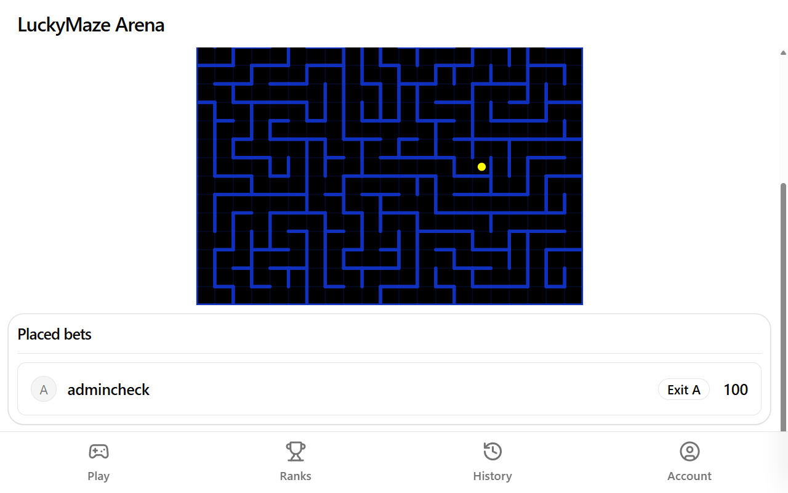
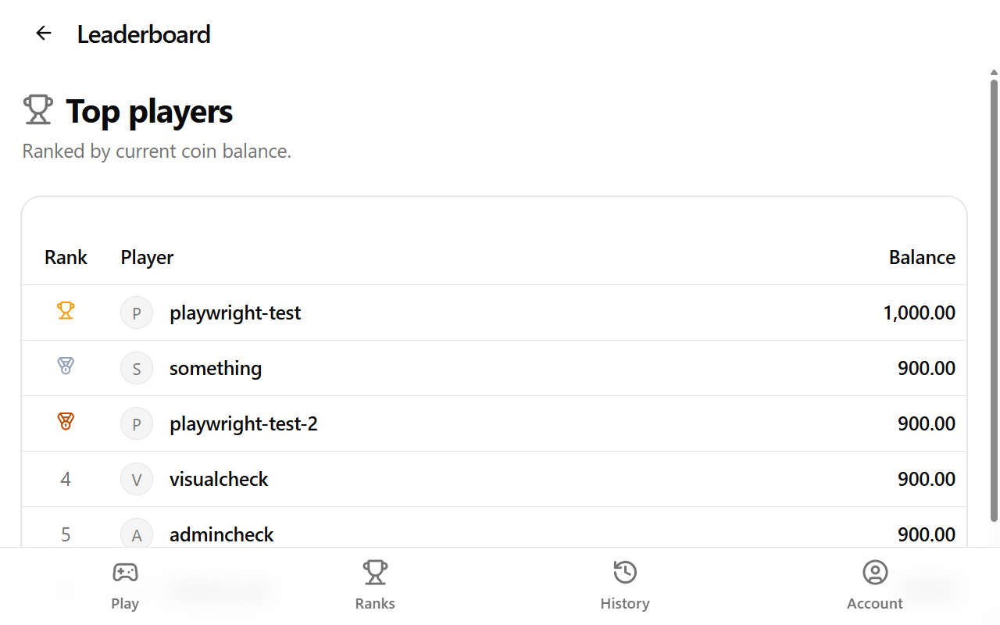
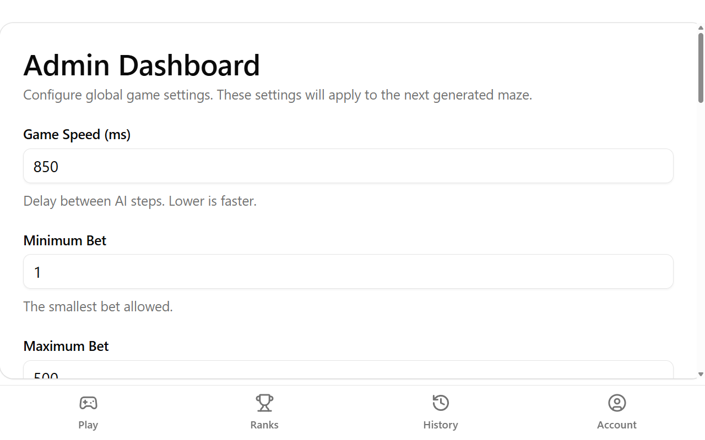

  

  <strong>LuckyMaze</strong> 
  A physical maze, a trained AI, and your bet on which exit it finds first.

  
  
  
  

---

> **Heads up:** LuckyMaze is an IDPA (school) project - built for one real physical cabinet and tested on that hardware, not a maintained product.

## What is LuckyMaze?

A CoreXY carriage under a 64x64 LED panel carries a magnet; a ball rides on top of it, visible through the panel. A tabular Q-learning agent trains from scratch on a brand new maze every round, then the panel and the ball move together, cell by cell, toward whichever exit it reaches first.

Players don't control any of that - they bet on which of the maze's two exits the AI will find, watch it happen live on their phones (a canvas rendering that mirrors the physical panel's own colors), and split the losers' pot if they called it right.

The same rig broadcasts its own WiFi hotspot with a captive portal, so players join the cabinet's network and land straight in the game - no address to type, no app to install.

## Screenshots

  
  

  

## Features

- **A real physical maze**: a CoreXY magnetic carriage (Klipper-driven) under a 64x64 HUB75 LED panel - the panel draws the maze and the AI's position, the magnet carries a ball to match it exactly.
- **Trains from scratch every round**: a tabular Q-learning solver, not a pretrained model - it learns the specific maze it's about to solve, live, right before each round starts, then discards what it learned once the round ends.
- **Bet on the outcome**: pick one of the maze's two exits before the AI starts moving; win a share of the pot from whoever bet on the exit it didn't reach.
- **Live everywhere**: game state, AI position and round phase all push over SignalR - the web app, the LED panel and the physical carriage update in the same instant.
- **Join by WiFi, not URL**: the cabinet broadcasts its own open hotspot with a captive portal - join the network and the sign-in prompt opens straight into the game.
- **Live hardware calibration**: pixel pitch, axis inversion, feed rates and acceleration all live in the admin panel, not `.env` - tune the physical rig without a redeploy.
- **Remote-manageable cabinet**: shut down or toggle the WiFi hotspot from the admin panel itself, through a small host-side agent - no SSH needed once it's set up.
- **Local login, no identity provider required**: [Toamaisutaa](https://github.com/PianoNic/Toamaisutaa) auth with open self-registration; generic OIDC bearer validation stays available if you want to bring your own provider later.

## Get started

- 📦 **[Deployment guide](docs/deployment.md)** - `docker compose up`, plus the hardware overlay for the real cabinet.
- 🛠️ **[Local dev setup](docs/dev_setup.md)** - Postgres, user secrets, running the API and frontend.
- 📶 **[Captive portal](docs/captive-portal.md)** - the cabinet's own WiFi hotspot, and how the sign-in prompt lands in the game.
- 🧪 **[Mock OIDC stack](e2e/README.md)** - exercising the identity-provider auth path locally without running one for real.

<strong>Tech stack</strong>

- **.NET 10** ASP.NET Core API (Mediator, EF Core + Npgsql, Clean Architecture).
- **Angular 21** + Signals, a canvas-rendered maze, SignalR client.
- **SignalR** for live game state, AI position and round phase.
- **Toamaisutaa** local login, with generic OIDC bearer validation available.
- **TUnit** + NSubstitute + EF Core InMemory for tests.
- **Klipper G-code** (CoreXY carriage) and a Raspberry Pi Pico running CircuitPython (LED panel), both driven from the same round loop.

## License

[GPLv3](LICENSE).

---

Made with care by <a href="https://github.com/PianoNic">PianoNic</a>

